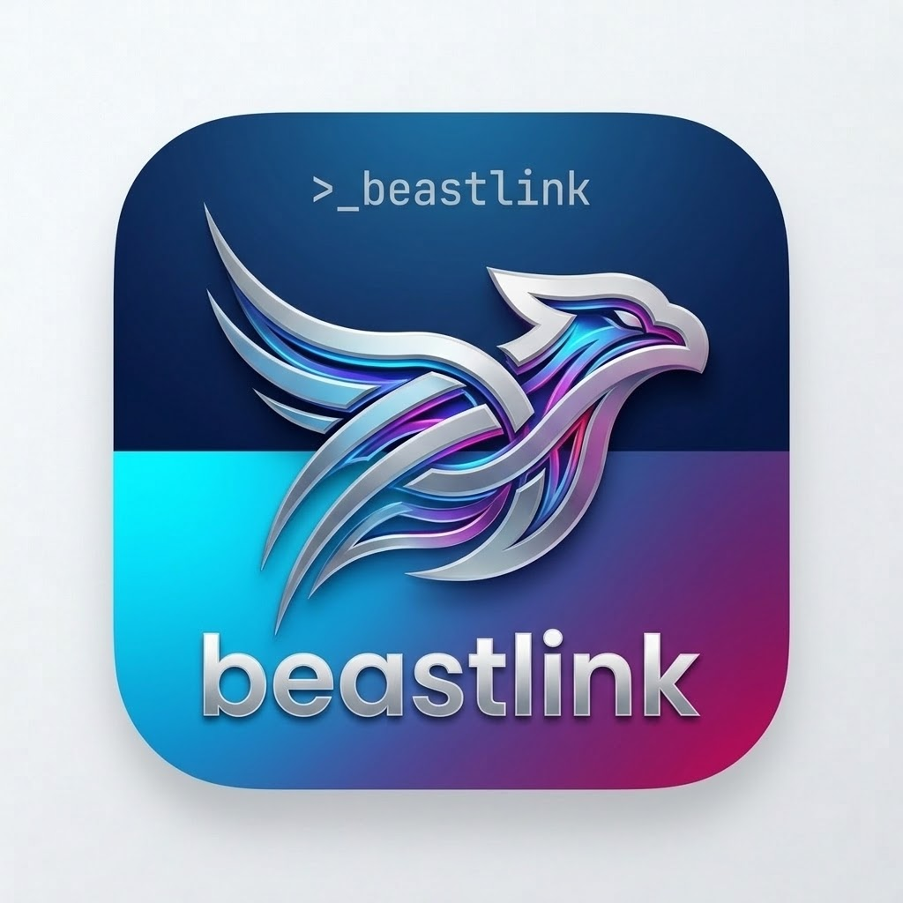

<p align="center">
  
</p>

<h1 align="center">Beastlink</h1>

<p align="center">
  <strong>A self-contained music plugin for Python Discord bots.</strong>
</p>

<p align="center">
  Stream music from YouTube, Spotify, SoundCloud, Apple Music, Deezer, and 1000+ sites — without Lavalink, without Java, without an external audio server.
</p>

<p align="center">
  <a href="https://pypi.org/project/beastlink/"></a>
  <a href="https://www.python.org/"></a>
  <a href="LICENSE"></a>
  <a href="https://discord.gg/jwo"></a>
</p>

<p align="center">
  <a href="#features">Features</a> ·
  <a href="#installation">Installation</a> ·
  <a href="#quick-start">Quick Start</a> ·
  <a href="#server-mode">Server Mode</a> ·
  <a href="#multi-language-clients">Multi-Language</a> ·
  <a href="#faq">FAQ</a>
</p>

---

## About

Beastlink is a **pure-Python audio node** for Discord bots. It streams audio directly from `yt-dlp` into `ffmpeg` and out to Discord — no disk writes, no downloads, no external services.

Designed as a drop-in replacement for Lavalink, but installable with a single `pip install beastlink` — no Java, no `.jar` files, no separate JVM process.

---

## Features

| Feature | Description |
| --- | --- |
| **PIPE streaming** | Audio flows `yt-dlp → ffmpeg → Discord` with zero disk writes |
| **Prefetch next track** | Zero gap between songs |
| **1-second pre-buffer** | No cuts, no stutters |
| **Real-time pacing** | `-re` flag prevents fast-forward |
| **Full controls** | Play, pause, resume, skip, stop, queue, loop, shuffle, volume |
| **Audio filters** | bassboost, treble, 8d, nightcore, vaporwave, karaoke, lofi, pop, rock, electronic, soft, concert, stadium |
| **Autoplay** | Continues with related tracks when the queue ends |
| **Playlist support** | YouTube, Spotify, SoundCloud, Apple Music |
| **Search cache** | Repeated queries are instant |
| **Multi-bot server** | Run one node, connect many bots |
| **Remote server** | Bot on Host A, node on Host B |
| **Plugin system** | Drop `.py` files into `plugins/` for custom hooks and filters |
| **Auto Node.js install** | No manual setup required |
| **Auto disk cleanup** | Purges temp on restart |

---

## Supported Sources

- YouTube, YouTube Music
- Spotify, Apple Music, Deezer
- SoundCloud, Bandcamp
- Twitch
- **1000+ more** via `yt-dlp`

---

## Requirements

- **Python** 3.9 or newer
- **ffmpeg** (one-time install)
- **Node.js** — auto-installed by Beastlink on first run

---

## Installation

### For Bot Developers

```bash
pip install beastlink
```

This installs `discord.py`, `yt-dlp`, `yt-dlp-ejs`, `PyNaCl`, `aiohttp`, `python-dotenv`, and `PyYAML`.

Install **ffmpeg** once:

```bash
# Ubuntu / Debian
sudo apt install ffmpeg

# macOS
brew install ffmpeg

# Windows
# Download from https://ffmpeg.org/download.html and add to PATH
```

---

## Quick Start

### Standalone Mode

The simplest way — the bot runs the audio node in-process.

```python
import discord
from discord.ext import commands
from beastlink import BeastlinkClient

bot = commands.Bot(command_prefix="!", intents=discord.Intents.all())
music = BeastlinkClient(bot)


@bot.command()
async def play(ctx, *, query: str):
    if not ctx.author.voice:
        return await ctx.send("Join a voice channel first.")
    if not ctx.voice_client:
        await ctx.author.voice.channel.connect()
    player = music.get_player(ctx.guild.id)
    await player.play(query, ctx.author)


bot.run("YOUR_BOT_TOKEN")
```

That's it. Music plays. No server process. No config file.

---

## Server Mode

Run the Beastlink node as a separate process. Useful for:

- Offloading CPU from your bot
- Sharing one node across multiple bots
- Running the node on a VPS

### Same-Host Server

```bash
cd beastlink-node
python beastlink_server.py
```

In your bot's `.env`:

```env
BEASTLINK_URL=http://127.0.0.1:2333
BEASTLINK_PASSWORD=youshallnotpass
```

### Remote Server

On the VPS:

```bash
python beastlink_server.py --host 0.0.0.0 --password sharedsecret
```

In each bot's `.env`:

```env
BEASTLINK_URL=http://vps-ip:2333
BEASTLINK_PASSWORD=sharedsecret
```

---

## The `beastlink-node/` Folder

This folder is the standalone node template:

```
beastlink-node/
├── beastlink_server.py         Launcher
├── beastlink.yml.example       Config template
├── cookies/
│   └── README.txt              Cookie instructions
├── plugins/
│   ├── README.txt
│   └── example_lyrics.py
└── logs/                       Auto-created on first run
```

On first run, `beastlink.yml`, `cookies/`, `plugins/`, and `logs/` are created automatically.

---

## Configuration

`beastlink.yml`:

```yaml
server:
  host: "0.0.0.0"
  port: 2333
  password: "youshallnotpass"

cookies:
  path: "cookies/cookies.txt"
  from_browser: ""

ytdlp:
  js_runtime: "node"
  extra_args: ""

logging:
  level: "INFO"
  file: "logs/beastlink.log"

audio:
  buffer_size: 1048576
  sample_rate: 48000
  channels: 2
```

---

## Commands

| Command | Description |
| --- | --- |
| `!play <query>` | Search and play a track or playlist |
| `!pause` | Pause playback |
| `!resume` | Resume playback |
| `!skip` | Skip the current track |
| `!stop` | Stop and clear the queue |
| `!queue` | Show the current queue |
| `!volume <0-200>` | Set the volume |
| `!loop` | Toggle loop mode |
| `!shuffle` | Shuffle the queue |
| `!filter <name>` | Apply an audio filter |

---

## Filters

Apply with `!filter <name>`:

`bassboost` · `treble` · `8d` · `nightcore` · `vaporwave` · `karaoke` · `lofi` · `pop` · `rock` · `electronic` · `soft` · `concert` · `stadium`

---

## Plugins

Drop `.py` files into `beastlink-node/plugins/` and they auto-load.

```python
from beastlink.plugins import Plugin


class MyPlugin(Plugin):
    name = "my_plugin"
    version = "1.0.0"

    def on_load(self, node):
        print("Ready")

    def on_track_start(self, node, track):
        print(f"Now playing: {track.title}")

    def register_filters(self):
        return {"reverb": "aecho=0.8:0.9:40|50:0.4|0.3"}
```

Available hooks:

- `on_load(node)`
- `on_unload(node)`
- `on_track_start(node, track)`
- `on_track_end(node, track)`
- `on_track_exception(node, track, error)`
- `register_filters() -> dict`

---

## Multi-Language Clients

Beastlink exposes an HTTP/WebSocket API compatible with Lavalink's protocol. Client libraries included:

- **Python** (native, full features)
- **JavaScript / Node.js** — `clients/javascript/`
- **Java** — `clients/java/`
- **C#** — `clients/csharp/`
- **Go** — `clients/go/`
- **Rust** — `clients/rust/`
- **PHP** — `clients/php/`

---

## Cookies

When YouTube blocks your IP with "Sign in to confirm you're not a bot", you need cookies.

**Manual** — export `cookies.txt` from a browser, drop it in `beastlink-node/cookies/`.

**Automatic** — pull from a local browser:

```yaml
cookies:
  from_browser: "chrome"
```

See `beastlink-node/cookies/README.txt` for full instructions.

---

## Project Structure

```
beastlink/
├── beastlink/                  Python package
├── beastlink-node/             Standalone node template
├── clients/                    Multi-language client libraries
├── examples/                   Usage examples
├── .github/                    Workflows and issue templates
├── CHANGELOG.md
├── CONTRIBUTING.md
├── Dockerfile
├── LICENSE
├── pyproject.toml
└── README.md
```

---

## Troubleshooting

| Problem | Fix |
| --- | --- |
| `ffmpeg not found` | Install ffmpeg (`apt install ffmpeg` or `brew install ffmpeg`) |
| `Sign in to confirm you're not a bot` | Add cookies (see Cookies section) |
| `Node.js not found` | Auto-install runs on first start — wait for it |
| `No module named beastlink` | Run `pip install beastlink` |
| Music won't start | Check the bot has voice permissions in the channel |

---

## FAQ

**Does Beastlink need Lavalink?**
No. Beastlink is a pure-Python replacement for Lavalink.

**Does it download songs?**
No. It streams via PIPE — audio flows `yt-dlp → ffmpeg → Discord` with no disk writes.

**Can multiple bots share one node?**
Yes. Run the node once, connect many bots via `BEASTLINK_URL`.

**Does it support Spotify?**
Yes — metadata is resolved via Spotify, audio is streamed from YouTube.

**Is Node.js required?**
Yes, for `yt-dlp-ejs` signature solving. Beastlink auto-installs it on first run.

---

## Contributing

See [CONTRIBUTING.md](CONTRIBUTING.md).

---

## Security

See [SECURITY.md](SECURITY.md).

---

## License

MIT — see [LICENSE](LICENSE).

---

## Author

**VampireDev**

- GitHub: [@vampirejjjadev](https://github.com/vampirejjjadev)
- Discord: [discord.gg/jwo](https://discord.gg/jwo)
